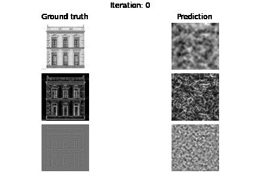

# sirenimage

Memorizing grayscale image using SIRENs. Please refer to this [blog](https://3d.bk.tudelft.nl/nail/siren/).

You can directly start playing with the jupyter-notebook.

 

## Reference Works 

[[1]](https://www.vincentsitzmann.com/siren/) Official SIREN project page  
[[2]](https://github.com/lucidrains/siren-pytorch) lucidrain implementation  
[[3]](https://github.com/jankrepl/mildlyoverfitted/tree/master/github_adventures/siren) Jan Krepl implementation